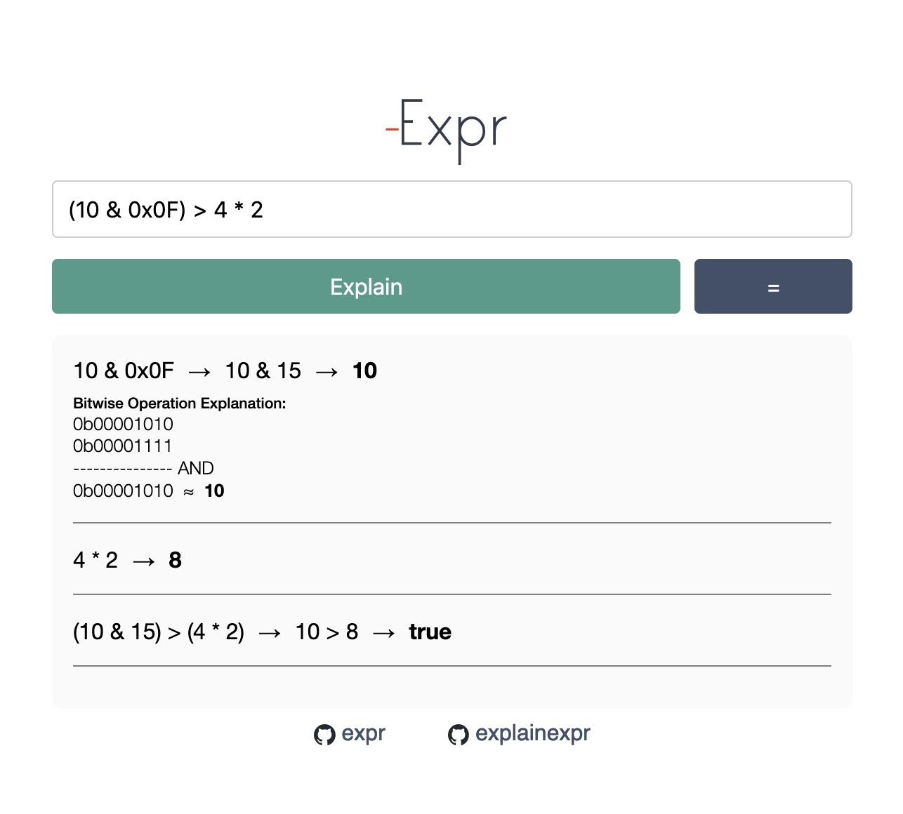

# Explain Expr

Explain Expr is an experimental Go WebAssembly Project to evaluate basic mathematical expression and boolean expression from a string input returning the output with step by step explanation. The evaluation process is performed by **[https://github.com/muktihari/expr](https://github.com/muktihari/expr)**, which is written in Go.

To create a compact binary size, we compile the Go source code using [tinygo](https://tinygo.org/docs/guides/webassembly/wasm/).

